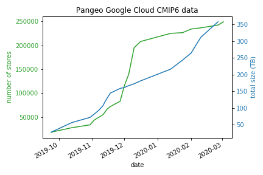

# The Pangeo CMIP6 Google Cloud Data - New Requests

This `project` repository (not a proper `package` yet) is work-in-progress for developing methods to handle new data requests automatically - at least as much as possible. I am also trying to make a first attempt at setting up a system to crowd-source the data problems/issues and solutions.  

I am just starting to use the 'First Pass' notebook, `nb1-DataRequests.ipynb` for responding to post-Hackathon requests. It seems to be operational and I welcome data requests at this point to test it out.    

At the same time, I am still adding to our CMIP6 cloud collection with my original notebooks. These 3 original notebooks (not in this repository) allow me to:
1. download a basic set of data for popular experiment_id, table_id and variable_id choices 
2. respond to the original hackathon data requests
3. convert our large local netcdf collection to zarrs and upload to GCS

But once these tasks are finished, we will focus on public data requests. Hopefully there will be enough pointers here to help anyone else willing to help with this effort!

## New Data Requests 
### Part I. First Pass - data with no issues
Procedure:
- Data Request is made at [Google Form](https://docs.google.com/forms/d/1g3rfuLBG6eOdoeN1hnGo2H_yB_aTL1MZLe3Rlx3eUNg/edit?usp=sharing) which triggers an Email notification (to Naomi, for now)

- Jupyter notebook: [nb1-DataRequests.ipynb](notebooks/nb1-DataRequests.ipynb) - start it running and leave it - after finished, check the logs
   - checks for new request(s)
   - searches our current Collection to see if data is already in GCS
   - searches ESGF for availability 
   - for each new zarr object:
      - download needed netcdf files from ESGF nodes or modeling centers to temporary location
      - opens netcdf files, concatenating in time, if necessary  (metadata is combined, concatenating 'tracking_id')
      - saves zarr in temporary location
      - checks zarr object for time grid integrity, etc
      - uploads to GCS
      - update the collection catalog for successes
      - update the exception catalog for failures
      - cleanup - remove netcdf and zarr temporary files
         
- Response is sent to requestor's email address

### Part II. Second Pass - data with issues
Procedure:
- Jupyter notebook: [nb2-DataExceptions.ipynb](notebooks/nb2-DataExceptions.ipynb) - work through the problem cases, one by one
   - reads the exception catalog for known issues (see [Processing Issues](https://docs.google.com/spreadsheets/d/e/2PACX-1vRxKgz1xCH7zhUoDnl_llgEvbj2ssxoJiTUdbkHkkfWiCKU8EfZtPerar3ELjoIzAda5giR06QvbWGE/pubhtml?gid=128595157&single=true)
   - for each new issue:
         - repeat the original request handling as above, checking for common issues (e.g., missing years, inconsistent coordinate names, etc)
         - very interactive, but standardized
         - fixable issues are identified and then dealt with by one of two methods:
              - fix manually and then upload zarr to cloud. this will only involve superficial changes such as modifying the  calendar, or choosing a subset of the netcdf files to use
              - add preprocessing code to be used in the First Pass
         - fatal issues are marked as 'noUse' and added to known issues
   - fatal issues are reported to the 'contact' listed in the global metadata for netcdf file(s), including the tracking_id(s)

## Data Exceptions and Cleaning- Request made at [Google Form]
- Data Issue report is made at [Google Form](https://docs.google.com/forms/d/1Qym-88kZ2iNDIzbz5mmWDXZ8HtsyP-QhT_Q62dVCvwc/edit?usp=sharing) which triggers an Email notification (to Naomi, for now)

- Jupyter notebook [nb3-DataCleaning.ipynb]()
   - in prep

- Original person who reported the issue is notified of outcome
